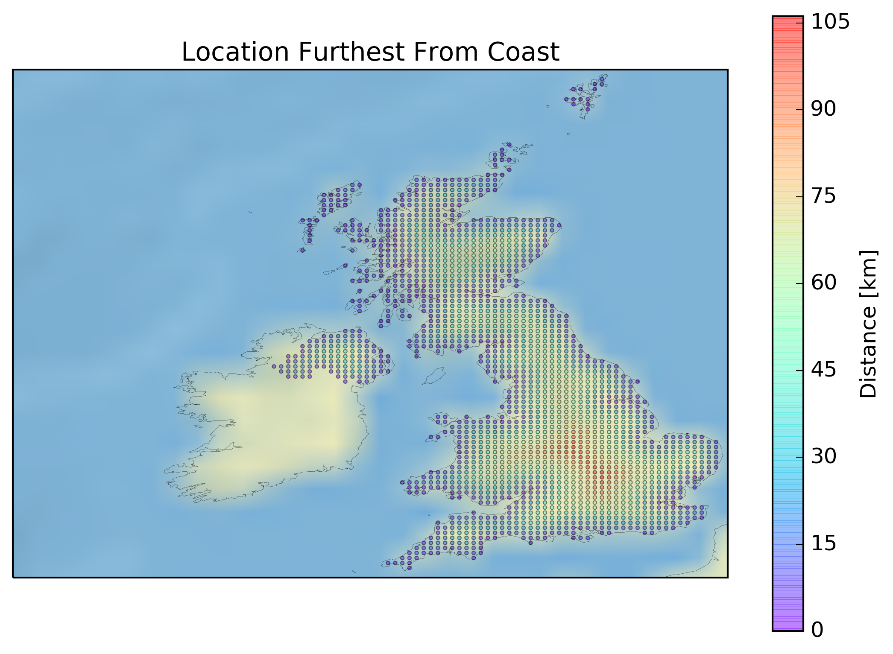

# Find Location Furthest From Coast (FLFFC)

This module contains all the functions required to calculate the location that is the furthest away from the coast in a particular country. It also contains a wrapper function to perform the job for you and save the answer as an image.

## Usage

FLFFC can be run very easily, below is a minimum working example.

```python
import flffc
flffc.run(dirOut = "myOutput", country = "Denmark", steps = 100)
```

If `country` is not specified it defaults to "United Kingdom". If `steps` is not specified it defaults to "50". If `dirOut` is not specified it defaults to "FLFFCoutput".

## Example Output

The last line of the output from FLFFC will tell you how far you can (roughly) get from the coast in your chosen country. For the United Kingdom (with 50 steps) the line is "The furthest you can get from the coast is ~101.6 km". FLFFC will also create a PNG in your current directory named after your chosen country showing where that location is. Below is the result for the United Kingdom.



## Dependencies

FLFFC requires the following Python modules to be installed and available in your `PYTHONPATH`.

* cartopy
* matplotlib
* numpy
* shapely

FLFFC uses some [Natural Earth](http://www.naturalearthdata.com/) resources via the [Cartopy](http://scitools.org.uk/cartopy/) module. If they do not exist on your system then Cartopy will download them for you in the background. Consequently, a working internet connection may be required the first time you run FLFFC.
